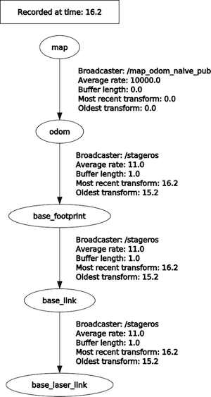

# Práctica 2 de Robots Móviles. Mapeado y localización en ROS con filtros de partículas

En esta práctica vamos a probar los algoritmos de mapeado, localización y navegación ya implementados en ROS.

Para crear el mapa, guardarlo y usarlo para localizarse y navegar tendréis que seguir una serie de pasos que no vamos a explicar con detalle aquí, ya que hay multitud de tutoriales en Internet y otros recursos que lo explican y no tiene mucho sentido repetirlo todo aquí. En el [apéndice](#apendice) tenéis unas cuantas referencias, pero podéis usar otras que encontréis en Internet, libros, etc. si lo deseáis.

En el enunciado tenéis requisitos mínimos, que son imprescindibles para aprobar, y requisitos adicionales si queréis obtener más nota.

## Construcción de mapas del entorno (requisito mínimo)

En esta parte tenéis que construir un mapa del entorno, pero ahora con los algoritmos ya implementados en ROS en lugar de usar el vuestro propio. El mapa se usará luego en el siguiente apartado para localizarse y poder navegar por el entorno.

Técnicamente hablando, el algoritmo de mapeado usado por defecto en ROS en realidad es un algoritmo de mapeado y localización simultáneos o SLAM en inglés. Es decir, a la vez que va construyendo el mapa se va localizando para reducir los errores de odometría. 

Mirad en el apéndice las referencias sobre cómo hacer el mapeado según el robot que queráis usar en simulación (Turtlebot 2 o 3).

> El Turtlebot 3 solo se puede usar con Gazebo, el simulador 3D (al menos con los paquetes que se instalan por defecto, es posible que por Internet podáis localizar alguna simulación en Stage). El campo de visión de su laser es de 360 grados, por lo que el mapeado tiende a funcionar bastante bien. El Turtlebot 2 se puede usar con Gazebo y Stage. El problema es que el simulado tiene un laser con un campo de visión muy pequeño tanto en Gazebo como en Stage, por lo que los mapas saldrán peor. En moodle tenéis una configuración alternativa para Turtlebot 2 y Stage con un campo de visión mucho mayor.

Pruebas a realizar:

- Construir el mapa en al menos 2 entornos lo más distintos que podáis, por ejemplo uno dentro de un edificio, otro en un espacio abierto con obstáculos más pequeños
- Incluid en la documentación de la práctica los mapas creados
- Explicar si salen mejor estos mapas o no que el de la práctica 1 y por qué creéis que es así. Si habéis observado problemas en los algoritmos (casos que no funcionen bien, etc) explicadlos también.
- Tened en cuenta que para poder luego localizarse y navegar hay que guardar el mapa en un formato especial. Esto se hace con el comando `rosrun map_server map_saver -f nombre_a_dar_al_mapa` (como seguramente aparecerá en cualquier tutorial de mapeado que uséis).


## Localización y navegación (requisito mínimo)

Una vez tenemos un mapa, lo podemos usar para localizar al robot (saber dónde está en todo momento) y para navegar por el entorno: ir del punto donde está el robot a un destino cualquiera, planificando la mejor trayectoria y sin chocar con obstáculos por el camino. 

De nuevo, las instrucciones concretas para hacer esto dependen del robot y del simulador empleado, tendrás que buscarlas por Internet o consultar las referencias del [apéndice](#apendice).

Pruebas a realizar:

- En los dos entornos en los que hayas construido el mapa prueba a hacer que el robot navegue de forma autónoma a un punto. Ten en cuenta que si la trayectoria es muy larga o pasa por sitios muy estrechos es posible que no funcione bien.
- Documenta la navegación del robot con videos grabados de la pantalla
- Explica en la memoria por escrito qué tal funciona la navegación (si el robot consigue llegar al destino de forma consistente) y la localización (si el robot sabe en todo momento dónde está) y posibles problemas (ya hemos comentado el de los sitios estrechos, si en las pruebas has descubierto otros problemas, coméntalos).

## Parte adicional (hasta 3 puntos) Construcción de mapas basados en *landmarks* con un algoritmo propio

En este apartado implementaremos un algoritmo sencillo para construir mapas basados en *landmarks*. Como para simplificar no tendremos en cuenta los errores de odometría, el mapa tendrá errores acumulativos con el tiempo

### Proyecto de ejemplo

Os dejamos un mundo simulado y un fichero de configuración de `rviz` para que podáis probar vuestro algoritmo.

Por simplicidad el simulador usado es *stage*, que no es ni siquiera 3D, ni implementa físicas realistas, pero consume pocos recursos computacionales, es fácil crear y configurar mundos simulados en él y tampoco necesitamos más "realismo" para este tipo de algoritmo. 

Primero deberíais crear un *workspace* de ROS salvo que queráis reutilizar uno ya hecho:

```bash
mkdir robots_moviles_ws
cd robots_moviles_ws
mkdir src
```

A continuación descargamos y compilamos los ficheros de ejemplo:

```bash
#hay que hacerlo en la carpeta  "src" del workspace
cd src
git clone https://github.com/ottocol/mapeado_landmarks
catkin_make
cd ..
#para actualizar las variables de entorno y que encuentre el paquete
source devel/setup.bash
```

Para probar el simulador, lanzar:

```bash
roslaunch mapeado_landmarks mapeado_landmarks.launch
```

Se abrirán dos ventanas: una con el simulador *stage* y otra con rviz. En *stage* el robot viene representado por el cuadrado amarillo. Si seleccionas la opción de menú de `View > Data` podrás ver el campo de visión del laser. En la ventana de `rviz` verás un *warning* relativo al mapa ya que todavía no hay ningún programa que lo esté publicando (¡es el que debes implementar!).

El *.launch* también pone en marcha un proceso de *teleop* que permite mover al robot con el teclado. Las teclas de control se mostrarán en la terminal. Recuerda que la ventana del *teleop* debe tener el foco de teclado para que la teleoperación funcione.

### Mapas basados en landmarks en ROS


### Sistemas de coordenadas en ROS. Transformación entre sistemas.

En cualquier robot móvil hará falta en general más de un sistema de coordenadas. Por ejemplo, sensores como las cámaras 3D o los láseres, cuando detectan información lo hacen en su propio sistema de referencia (los ejes coinciden con la posición física del sensor), pero típicamente no coincidirán con los ejes del cuerpo del robot. Por otro lado, el sistema de referencia del cuerpo del robot se mueve conforme se mueve éste, pero necesitamos también sistemas externos "fijos". Por ejemplo, el sistema de coordenadas de un mapa del entorno.

Esto hace que habitualmente sea necesario transformar coordenadas de un sistema a otro. Por ejemplo, en nuestro caso **necesitamos transformar las coordenadas de los obstáculos detectados por el laser a coordenadas del mapa**, para poder ir construyéndolo. Afortunadamente como veremos ROS nos va a ayudar mucho en esta tarea.

En el [REP (ROS Enhancement Proposal) 105](https://www.ros.org/reps/rep-0105.html) se definen una serie de sistemas de coordenadas estándar para robots móviles. Los que nos interesan de momento son los siguientes:

- `base_link`: El sistema de coordenadas de la plataforma base del robot. Es un sistema local al robot, que se mueve cuando este se mueve. Típicamente se coloca en el centro de rotación del robot.
- `odom`: Este sistema de coordenadas está fijo en el mundo (no se mueve cuando se mueve el robot) y su origen y orientación 0 coincide con la posición de partida del robot. Es lo que se conoce habitualmente como *odometría*: conforme el robot se va moviendo también va estimando su posición actual con respecto a este sistema.
- `map`: Es un sistema de coordenadas asociado a un mapa del entorno. Está fijo en el mundo (no se mueve cuando se mueve el robot) y su origen y orientación 0 es arbitrario y depende de quien haya creado el mapa. El robot puede estimar su posición con respecto a este sistema comparando el mapa con lo que perciben actualmente los sensores. Esto se conoce como *localización* (lo veremos en la práctica 2).

Además, como usaremos un laser para detectar obstáculos, tendremos un sistema asociado a él: `base_laser_link` es el nombre típico que se le suele dar, y es en el que se obtienen las medidas del laser.

Si tenéis lanzado el `mapeado_naive.launch` de ejemplo podéis ver estos sistemas y las relaciones entre ellos ejecutando en una terminal:

```bash
rosrun rqt_tf_tree rqt_tf_tree
```



Debería aparecer una figura similar a la figura 2. Vemos que es un grafo en el que los nodos son los diferentes sistemas de coordenadas. Se conoce como *grafo de transformaciones*. Que aparezca una arista que va de un nodo A a un nodo B indica que ROS conoce la matriz que transforma el sistema A en el B. Si conocemos la transformación de A a B también tenemos la de B a A, ya que es la matriz inversa, de modo que la dirección del arco no es importante.

En un grafo de transformaciones **podemos calcular la transformación entre dos sistemas cualesquiera A y B siempre que haya un camino entre ambos**, sin importar la dirección de las flechas. 

Aunque parezca antiintuitivo, **la transformación que lleva de un sistema A al sistema B, en realidad nos sirve para pasar puntos dados en el sistema B al sistema A**. Tenéis más información sobre la razón de esto en el apéndice 1.

Por ejemplo, en nuestro caso queremos pasar un punto dado en el sistema `base_laser_link` al sistema `map` y por tanto necesitamos la transformación de `map` a `base_laser_link`. Vemos que hay un camino que une ambos nodos, de modo que podemos pedirle a ROS la transformación, vamos a ver cómo hacerlo.

El código básico en Python para transformar entre `map` y `base_laser_link` sería el siguiente:

```python
import tf2_ros

tfBuffer = tf2_ros.Buffer()
listener = tf2_ros.TransformListener(tfBuffer)
try:
	#Obtener la transformación entre un sistema "padre" e "hijo". 
	#Time(0) indica que queremos la última disponible
    trans = tfBuffer.lookup_transform('map', 'base_laser_link', rospy.Time(0))
#si se da alguna de estas excepciones no se ha podido encontrar la transformación    
except (tf2_ros.LookupException, tf2_ros.ConnectivityException,
            tf2_ros.ExtrapolationException):
    rospy.logerr("No se ha podido encontrar la transformación")
```

Nótese que al comienzo de la ejecución es normal que salte la excepción, ya que las transformaciones se hacen gracias a mensajes publicados por ROS y es posible que inicialmente no haya ninguno disponible.

La transformación podemos aplicarla a un punto con coordenadas `(x,y,z)` como sigue:

```python
import tf2_geometry_msgs
#supongamos que tenemos las coordenadas (x,y) de una lectura del laser
#el tercer parámetro es z que no nos interesa en este caso
punto = Point(x,y,0)
ps = PointStamped(point=punto)
#"trans" sería la transformación obtenida anteriormente
punto_trans = tf2_geometry_msgs.do_transform_point(ps, trans)
```

Nota: en nuestro caso los sistemas `map` y `odom` ocupan la misma posición. Recordemos que `odom` es la posición inicial del robot "cuando se pone en marcha". Eso quiere decir que el (0,0,0) del mapa corresponderá con esta posición. Esta información se la damos a ROS en el `mapeado_naive.launch` mediante un `static_transform_publisher`, que es el tipo de nodo que se usa para publicar transformaciones estáticas (que no cambian con el tiempo) entre dos sistemas. Mira la línea 8 del archivo y la wiki de ROS sobre el [`static_transform_publisher`](http://wiki.ros.org/tf#static_transform_publisher) para más detalles.

## Parte adicional: probar el mapeado y navegación en los robots reales (hasta 1 punto)

**Los días 23 y 30 de octubre** se podrá probar el mapeado y la localización en los Turtlebot reales. Se harán turnos para que se puedan usar los robots en grupos de 2-3 personas, **os puede tocar hacer la prueba uno de estos dos días (pero no ambos)**. La lista de turnos se elaborará durante la semana del 14 al 20 de octubre. 

Se publicará una guía indicando los pasos exactos para probar mapeado y navegación en los Turtlebot. En esta guía se indicará qué pruebas debéis hacer y cómo documentarlas. La entrega de estas pruebas se realizará junto con la memoria principal de la práctica. Todos los que hayáis probado juntos el robot tendréis la misma puntuación.

## Parte adicional: análisis de los modelos de movimiento y de observación de ROS (hasta 1.5 puntos)

Como hemos visto en clase de teoría, para poder implementar localización y mapeado basado en filtros de Bayes, que es lo que usa ROS por defecto, necesitamos primero un modelo probabilístico de movimiento y del sensor.

Como el código fuente de ROS está disponible en Internet, en este apartado se trata de que lo examines y compares con lo visto en clase de teoría. Explica lo que hace el código de la forma más detallada que puedas y referencia en todo lo posible las transparencias de teoría relevantes (por ejemplo, "estas líneas calculan la probabilidad de obstáculos inesperados, como se hace en la figura de la derecha de la transparencia X del tema Y...").

- El modelo de observación o del sensor está en [https://github.com/ros-planning/navigation/blob/melodic-devel/amcl/src/amcl/sensors/amcl_laser.cpp
](https://github.com/ros-planning/navigation/blob/melodic-devel/amcl/src/amcl/sensors/amcl_laser.cpp
). En concreto el modelo de "haz de luz" que se explicó en clase está en el método `BeamModel`
- El modelo de movimiento está en [https://github.com/ros-planning/navigation/blob/melodic-devel/amcl/src/amcl/sensors/amcl_odom.cpp
]( https://github.com/ros-planning/navigation/blob/melodic-devel/amcl/src/amcl/sensors/amcl_odom.cpp
). En concreto la aplicación del modelo de movimiento muestreado está en el método `UpdateAction`.

Para la máxima nota en este apartado investiga por tu cuenta el modelo basado en scan o *likelihood field model*, que no dio tiempo a ver en clase de teoría, explicando cómo funciona en general y cómo funciona en el código fuente.

> Para resolver esta parte os recomendamos que hagáis uso de ChatGPT o algún otro LLM (Modelo del Lenguaje) como Bard. Copiad y pegad el código relevante y pedid que os lo explique, lo suele hacer bastante bien. Como siempre que uséis un modelo del lenguaje, chequead con lo visto en teoría o con otras fuentes que la explicación tiene sentido y no está inventando cosas. 


## Parte adicional: análisis de un filtro de partículas para localización (hasta 1.5 puntos)

Probad alguna implementación ya hecha de un algoritmo de filtro de partículas para localización. No es necesario que esté integrada en ROS y puede estar implementada en cualquier lenguaje. En Internet hay multitud de ellas. Busca alguna para la que esté disponible el código, y conozcas el lenguaje de programación, ya que deberás examinar su funcionamiento.

Deberías

+ Realizar varias pruebas con el algoritmo variando los parámetros que puedas (como mínimo el número de partículas)
+ Explicar con el máximo detalle que puedas cómo funciona el código identificando las partes que hemos visro en clase (modelo del sensor, modelo de movimiento, bucle del algoritmo, resampling...). Hazlo en forma de comentarios al código fuente.
+ Graba un vídeo de máximo 5 minutos explicando el código y haciendo pruebas del algoritmo. No es necesario que salgas tú directamente :) solo la pantalla 

## Entrega de la práctica

### Baremo

- **Requisitos mínimos (hasta un 5)**: la práctica debe estar adecuadamente documentada, detallando los resultados de todos los experimentos realizados. 
- **(hasta 3 puntos adicionales)**: implementar el algoritmo de mapeado basado en *landmarks*.
- **(hasta 1 punto adicional)**: probar alguna implementación ya hecha de un algoritmo de filtro de partículas para localización. 
- **(hasta 1 punto adicional)** probar el mapeado en los Turtlebot reales.
- En lugar de alguno de los puntos anteriores se puede hacer cualquier otra ampliación que se os ocurra, por ejemplo
	+ (hasta 1 punto) Leer un artículo científico sobre mapeado/localización (estado actual de la investigación, algoritmos alternativos...) haciendo un resumen del contenido. Si no sabéis cuál elegir, preguntad al profesor.
	+ (hasta 1 punto) Probar algún otro algoritmo de mapeado o localización que esté implementado en ROS y esté disponible en Internet. En la memoria de la práctica deberíais incluir cómo lo habéis instalado, una breve explicación de las ideas en que se basa y resultados de funcionamiento, comparándolo con el algoritmo por defecto de ROS e indicando también casos en los que pueda fallar si así ha sido.
	+ **Consultad con el profesor** lo que queréis hacer para ver cuánto se podría valorar en el baremo, si queréis que os pase enlaces a artículos o algoritmos, etc.


### Plazos y procedimiento de entrega

La práctica se podrá entregar hasta las 23:59 horas del **martes 5 de Noviembre**.

La entrega se realizará a través del Moodle de la asignatura. Tiene un tamaño máximo de 20Mb (de momento no lo podemos ampliar), por lo que si necesitáis subir más datos tendréis que poner enlaces a vuestro Google Drive o similar o si son videos, enlaces a Youtube o donde lo podáis subir.

## <a name="apendice">Apéndice: Referencias sobre mapeado y localización en ROS</a>

Para realizar los requisitos mínimos necesitaréis consultar información adicional sobre localización y mapeado en ROS, ya que en clase de prácticas no vamos a explicar las instrucciones exactas para realizarlo. No tenéis por qué seguir exactamente estas referencias que ponemos aquì, podéis usar cualquier otra si os gusta más.

> Como recomendación general, fijaos en que la biblioteca de la UA tiene disponibles muchos [libros en formato electrónico](https://ua.on.worldcat.org/search?databaseList=1953%2C1931%2C1875%2C1941%2C2259%2C2237%2C3313%2C2375%2C239%2C2570%2C638%2C2260&queryString=ros+robots&clusterResults=true) sobre ROS. En bastantes de ellos se explica el mapeado y la localización en ROS. 

### Turtlebot 2

Si tenéis instalado el soporte de Turtlebot 2 podéis consultar estas referencias. Recordad que los ordenadores del laboratorio tienen este soporte instalado.

- Para el simulador **Stage** los capítulos 9 y 10 respectivamente del libro *"Programming Robots with ROS"*, de Quigley, Gerkey y Smart, ed. O'Reilly, 2015. El capítulo 9 os puede servir entero y el 10 hasta la sección "Navigating in code", no incluído. Podéis [consultarlo *online*](https://linker2.worldcat.org/?jHome=https%3A%2F%2Fbua.idm.oclc.org%2Flogin%3Furl%3Dhttps%3A%2F%2Flearning.oreilly.com%2Flibrary%2Fview%2F%7E%2F9781449325480%2F%3Far&linktype=best) por medio de la biblioteca de la UA. 

> **IMPORTANTE**: Los ficheros de configuración de Stage para Turtlebot 2 que están preparados para mapeado y navegación usan en lugar de un laser una kinect simulada, con un campo de visión muy reducido. En el moodle tienes los ficheros modificados para ampliar el campo de visión al que tienen los turtlebot reales, usa estos, los mapas deberían salir mucho mejor.

- Para **Gazebo** podéis seguir por ejemplo [este tutorial online](https://learn.turtlebot.com/2015/02/03/8/). Recordad que en Turtlebot2/Gazebo el sensor de rango simulado tiene un campo de visión pequeño y los algoritmos no funcionarán tan bien.

### Turtlebot 3

#### Web de Robotis

Si no tenéis los paquetes de Turtlebot 3 instalados podéis ver las [instrucciones de instalación](https://emanual.robotis.com/docs/en/platform/turtlebot3/quick-start/) en la web de La empresa Robotis, fabricante de los servos que llevan los Turtlebot 3 (aseguráos de seleccionar vuestra versión de ROS en la barra superior)

Además hay un manual *online* con una sección para [SLAM simulado](https://emanual.robotis.com/docs/en/platform/turtlebot3/slam_simulation/) y otra para [navegación](https://emanual.robotis.com/docs/en/platform/turtlebot3/nav_simulation/) (de nuevo, aseguráos de seleccionar vuestra versión de ROS).

#### Libro "ROS Robot Programming"

En el libro "ROS robot programming", que está escrito por los desarrolladores del Turtlebot 3 y está [disponible de manera gratuita](https://www.robotis.us/ros-robot-programming-book-digital-copy/) puedes encontrar más información en el capítulo 11. (*Antes se podía descargar directamente con un enlace, ahora parece que hace falta registrarse, es probable que esté disponible en otros sitios web*).


Aunque en el libro lo hace con un turtlebot de verdad, para hacerlo en simulación básicamente se trata de sustituir el comando `roslaunch turtlebot3_bringup turtlebot3_robot.launch`, que arranca el robot real por `roslaunch turtlebot3_gazebo turtlebot3_world.launch`que arranca la simulación.

